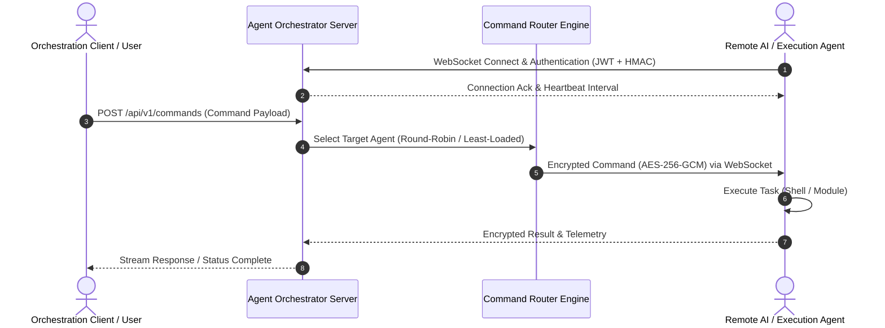

# 🤖 Remote Agent Orchestration Framework

<p align="center">
  <a href="https://github.com/zyekhabdul/remote-agent-orchestration/actions/workflows/ci.yml">
    
  </a>
  <a href="LICENSE">
    
  </a>
  <a href="https://nodejs.org/">
    
  </a>
  <a href="https://www.typescriptlang.org/">
    
  </a>
  <a href="Dockerfile">
    
  </a>
</p>

A production-ready, distributed agent management system with secure command routing, real-time communication, and comprehensive monitoring.

---

## 🏗️ Architecture & Command Routing Flow




## 🚀 Features

- **Agent Management**: Register, monitor, and manage distributed agents with lifecycle tracking
- **Command Routing**: Intelligent multi-strategy routing (round-robin, least-loaded, broadcast)
- **Secure Transport**: End-to-end encryption (AES-256-GCM) and HMAC message signing
- **Real-time Communication**: WebSocket-based bidirectional communication
- **Health Monitoring**: Periodic health checks with auto-recovery capabilities
- **Event System**: Async pub/sub event emitter with subscription management
- **JWT Authentication**: Token-based authentication with refresh token support
- **Rate Limiting**: Built-in DDoS protection with configurable rate limits
- **Comprehensive Logging**: Structured JSON logging with Pino

## 📋 Requirements

- Node.js >= 16.0.0
- npm or yarn
- Redis (optional, for production deployments)
- Docker (optional)

## 🛠️ Installation

```bash
# Clone repository
git clone https://github.com/your-org/remote-agent-orchestration.git
cd remote-agent-orchestration

# Install dependencies
npm install

# Copy environment template
cp .env.example .env

# Edit configuration
nano .env
```

## ⚙️ Configuration

Edit `.env` file with your settings:

```env
NODE_ENV=development
PORT=3000
HOST=0.0.0.0

JWT_SECRET=your-super-secret-key-change-in-production
JWT_EXPIRATION=24h

WS_PORT=3001
AGENT_HEARTBEAT_INTERVAL=60000
COMMAND_TIMEOUT=30000

DB_TYPE=redis
DB_HOST=localhost
DB_PORT=6379
```

## 🚀 Getting Started

### Development Mode

```bash
# Install dependencies
npm install

# Start development server
npm run dev

# In another terminal, compile TypeScript
npm run build

# Run tests
npm test

# Run tests in watch mode
npm run test:watch
```

### Production Build

```bash
# Build TypeScript
npm run build

# Start production server
npm start
```

The server will start on `http://localhost:3000`
WebSocket server on `ws://localhost:3001`

## 📚 API Examples

### Health Check
```bash
curl http://localhost:3000/api/v1/health
```

### Register Agent
```bash
curl -X POST http://localhost:3000/api/v1/agents \
  -H "Content-Type: application/json" \
  -d '{
    "name": "prod-agent-01",
    "metadata": {
      "version": "1.0.0",
      "platform": "Linux",
      "architecture": "x86_64",
      "osVersion": "5.10.0",
      "hostname": "prod-agent-01",
      "timezone": "UTC"
    },
    "capabilities": [
      {"name": "shell", "version": "1.0", "enabled": true}
    ],
    "resources": {
      "cpu": 50,
      "memory": 2048,
      "disk": 10240,
      "bandwidth": 100
    }
  }'
```

### List Agents
```bash
curl http://localhost:3000/api/v1/agents
```

### Submit Command
```bash
curl -X POST http://localhost:3000/api/v1/commands \
  -H "Content-Type: application/json" \
  -d '{
    "name": "Health Check",
    "module": "shell",
    "action": "execute",
    "parameters": {"command": "curl https://health.example.com"},
    "target": {"agentCapability": "shell"},
    "priority": "high",
    "timeout": 30000
  }'
```

### Get Command Status
```bash
curl http://localhost:3000/api/v1/commands/{commandId}
```

## 🔌 WebSocket Examples

### Connect Agent
```javascript
const ws = new WebSocket('ws://localhost:3001?client_id=agent-001');

ws.onopen = () => {
  // Register agent
  ws.send(JSON.stringify({
    id: 'reg-1',
    type: 'agent:register',
    payload: {
      name: 'prod-agent-01',
      metadata: {...},
      capabilities: [...],
      resources: {...}
    },
    timestamp: new Date(),
    sender: 'agent-001'
  }));
};

ws.onmessage = (event) => {
  const message = JSON.parse(event.data);
  console.log('Received:', message);
};
```

### Send Heartbeat
```javascript
ws.send(JSON.stringify({
  id: 'hb-1',
  type: 'agent:heartbeat',
  payload: {
    agentId: 'agent-123',
    resources: {
      cpu: 45,
      memory: 1024,
      disk: 5120,
      bandwidth: 100
    }
  },
  timestamp: new Date(),
  sender: 'agent-001'
}));
```

## 🧪 Testing

```bash
# Run all tests
npm test

# Run tests with coverage
npm test -- --coverage

# Run specific test file
npm test -- agent-manager.test.ts

# Watch mode
npm run test:watch
```

## 🐳 Docker

### Build Docker Image
```bash
npm run docker:build
```

### Run with Docker Compose
```bash
npm run docker:run
```

### Stop Docker Services
```bash
npm run docker:stop
```

## 📊 Project Structure

```
src/
├── config/              # Configuration modules
│   ├── app.config.ts
│   ├── auth.config.ts
│   └── database.config.ts
├── core/                # Core business logic
│   ├── agent_manager.ts
│   ├── command_router.ts
│   ├── auth_guard.ts
│   ├── event_emitter.ts
│   ├── secure_transport.ts
│   └── health_monitor.ts
├── api/                 # API layer
│   ├── controllers/
│   └── middleware/
├── services/            # Business services
│   ├── agent.service.ts
│   └── command.service.ts
├── types/               # TypeScript type definitions
├── utils/               # Utility functions
├── websocket/           # WebSocket server
└── index.ts             # Application entry point

tests/
├── setup.ts
├── unit/
│   ├── agent-manager.test.ts
│   └── command-router.test.ts
└── integration/

examples/
├── dummy-data.ts        # Example: Register dummy agents
└── ws-client.ts         # Example: WebSocket client
```

## 🔐 Security

- **Encryption**: AES-256-GCM for message encryption
- **Authentication**: JWT with refresh tokens
- **Signing**: HMAC-SHA256 for message integrity
- **Rate Limiting**: Built-in protection against DDoS
- **HTTPS**: Optional TLS/SSL support
- **CORS**: Configurable cross-origin policies
- **Password Hashing**: PBKDF2 with 100,000 iterations

## 📈 Monitoring

### System Health
```bash
curl http://localhost:3000/api/v1/health
```

### System Status
```bash
curl http://localhost:3000/api/v1/status
```

### Agent Health
```bash
curl http://localhost:3000/api/v1/agents/{agentId}/health
```

## 🔄 Event System

Events emitted by the system:

- `agent:registered` - New agent registered
- `agent:deregistered` - Agent deregistered
- `agent:statusChanged` - Agent status changed
- `agent:healthReport` - Health report received
- `agent:event` - Generic agent event
- `command:routed` - Command routed to agents
- `command:started` - Command execution started
- `command:completed` - Command execution completed
- `command:failed` - Command execution failed
- `ws:connected` - WebSocket client connected
- `ws:disconnected` - WebSocket client disconnected

Subscribe to events:

```javascript
import { eventEmitter } from '@core/event_emitter';

eventEmitter.subscribe('agent:registered', (agent) => {
  console.log('New agent registered:', agent);
});
```

## 🛡️ Best Practices

1. **Always use HTTPS/TLS in production**
2. **Keep JWT_SECRET and passwords secure**
3. **Monitor agent health regularly**
4. **Implement proper audit logging**
5. **Use rate limiting for public endpoints**
6. **Enable CORS only for trusted origins**
7. **Regularly rotate authentication tokens**
8. **Keep dependencies updated**

## 📝 Environment Variables

See `.env.example` for a complete list. Key variables:

| Variable | Description | Default |
|----------|-------------|---------|
| NODE_ENV | Environment | development |
| PORT | HTTP server port | 3000 |
| WS_PORT | WebSocket port | 3001 |
| JWT_SECRET | JWT signing key | (required) |
| DB_TYPE | Database type | redis |
| TLS_ENABLED | Enable HTTPS | false |

## 🐛 Troubleshooting

### Port already in use
```bash
# Find process using port
lsof -i :3000

# Kill process
kill -9 <PID>
```

### WebSocket connection refused
- Check `WS_PORT` is not in use
- Verify firewall allows WebSocket connections
- Check server logs for errors

### Agent heartbeat timeout
- Increase `AGENT_HEARTBEAT_TIMEOUT`
- Check agent network connectivity
- Verify agent is sending heartbeats

## 📖 Documentation

- [Architecture Guide](./docs/ARCHITECTURE.md)
- [API Reference](./docs/API.md)
- [Security Model](./docs/SECURITY.md)
- [Deployment Guide](./docs/DEPLOYMENT.md)

## 🤝 Contributing

1. Fork the repository
2. Create feature branch (`git checkout -b feature/amazing-feature`)
3. Commit changes (`git commit -m 'Add amazing feature'`)
4. Push to branch (`git push origin feature/amazing-feature`)
5. Open pull request

## 📄 License

Apache License 2.0 - see LICENSE file for details

## 🆘 Support

For issues and questions:
- GitHub Issues: [Create an issue](https://github.com/your-org/remote-agent-orchestration/issues)
- Documentation: See `/docs` directory
- Examples: See `/examples` directory

## 🎯 Roadmap

- [ ] PostgreSQL/MongoDB support
- [ ] Advanced analytics and metrics
- [ ] Agent clustering
- [ ] Command scheduling
- [ ] Multi-region support
- [ ] gRPC support
- [ ] Web UI dashboard
- [ ] Terraform provider

---

**Made with ❤️ for distributed systems engineers**
